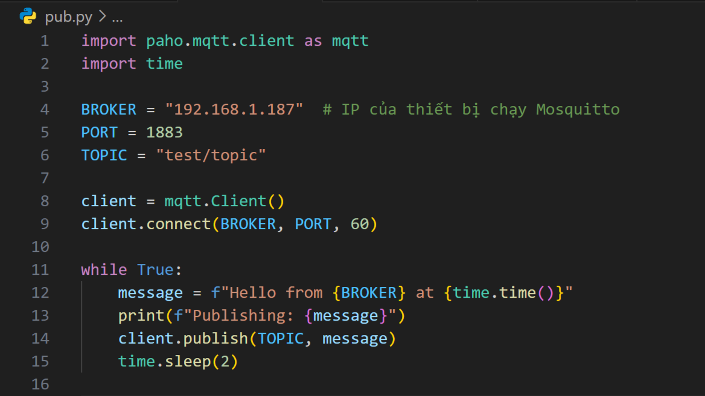
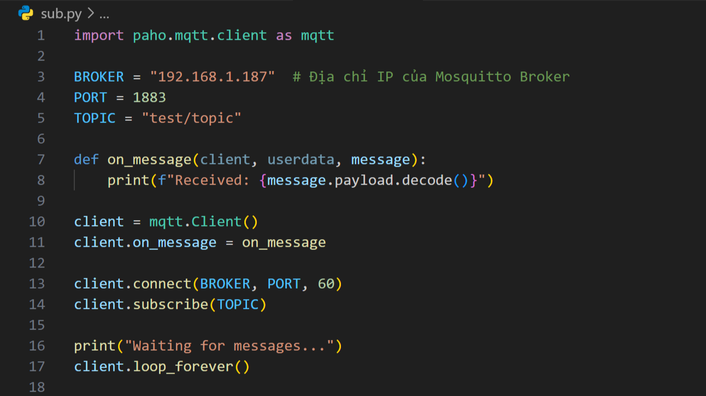

## 1. Tạo môi trường ảo Python

#### Step 1: Cài đặt `virtualenv` (nếu chưa có)

    pip install virtualenv

#### Step 2: Tạo môi trường ảo

    python -m venv myenv

Thay `myenv` bằng tên thư mục bạn muốn đặt cho môi trường ảo.

#### Step 3: Kích hoạt môi trường ảo

-   Trên `Windows`:

        myenv\Scripts\activate

-   Trên `macOS/Linux`:

        source myenv/bin/activate

#### Step 4: Cài đặt các gói trong môi trường ảo

    pip install ...

-   `django`

-   `paho-mqtt`

#### Step 5: Thoát khỏi môi trường ảo

    deactivate

## 2. Nếu lỗi khi active

#### Step 1: Kiểm tra `Execution Policy` hiện tại trong `cmd`

    Get-ExecutionPolicy

Nếu nó trả về `Restricted`, nghĩa là script PowerShell bị chặn.

#### Step 2: Gõ lệnh sau để thay đổi chính sách

    Set-ExecutionPolicy Unrestricted -Scope Process

#### Hoặc nếu bạn muốn áp dụng vĩnh viễn (có thể gây rủi ro bảo mật), dùng:

    Set-ExecutionPolicy RemoteSigned -Scope CurrentUser

#### Step 3: Kích hoạt lại môi trường ảo

    myenv\Scripts\Activate

#### Step 4: Sau khi làm xong, nếu muốn khôi phục lại chính sách mặc định, chạy:

    Set-ExecutionPolicy Restricted -Scope CurrentUser

## 3. Cài đặt `Mosquitto`

#### Step 1: Tải file `.exe`

Tải tại [Mosquitto](https://mosquitto.org/download/)

#### Step 2: Thêm `Mosquitto` vào System PATH

1. Nhấn `Win + R`, gõ `sysdm.cpl`, nhấn `Enter`
2. Chuyển sang tab `Advanced`, bấm vào `Environment Variables`
3. Trong phần `System variables`, tìm và chọn `Path`, rồi bấm `Edit`
4. Bấm `New`, nhập đường dẫn thư mục `Mosquitto`, ví dụ: `C:\Program Files\Mosquitto`

#### Step 3: Chạy `Mosquitto Broker` tại cmd

    mosquitto -v

## 4. Sử dụng `Mosquitto MQTT` trên cùng mạng LAN

#### Step 1: Tìm địa chỉ IP của thiết bị chạy `Mosquitto` trong cmd

-   Trên `Windows`:

        ipconfig

-   Trên `macOS/Linux`:

        ifconfig

#### Step 2: Chạy `Mosquitto Broker`

    mosquitto -v

#### Step 3: Tạo `pub.py` và đổi `IP Broker` trên `thiết bị 1`

Ví dụ: 

#### Step 4: Tạo `sub.py` trên `thiết bị 2`

Ví dụ: 

#### Step 5: Chạy chương trình

-   Trên thiết bị gửi (Publisher)

        python pub.py

-   Trên thiết bị nhận (Subscriber)

          python sub.py

## 5. Lỗi `ConnectionRefusedError: [WinError 10061]`

#### Step 1: Kiểm tra xem `Mosquitto` có đang chạy không

    mosquitto -v

Nếu `Mosquitto` đang chạy, bạn sẽ thấy log như sau:

    mosquitto version ... running

#### Step 2: Kiểm tra địa chỉ IP của máy chạy `Mosquitto`

#### Step 3: Mở cổng `1883` trong Windows Firewall

Mở `Win + X → Windows Terminal (Admin)`

    netsh advfirewall firewall add rule name="MQTT" dir=in action=allow protocol=TCP localport=1883

#### Step 4: Kiểm tra kết nối từ Client

-   Trên máy client

        telnet 192.168.1.187 1883

    `192.168.1.187` là IP của máy chạy Mosquitto

    -   Nếu hiện màn hình trống, port 1883 đã mở.
    -   Nếu báo lỗi "`Could not open connection`", Mosquitto chưa mở hoặc bị firewall chặn.

#### Step 5: Sửa file cấu hình `Mosquitto` (nếu cần)

-   Trên `Windows`:

    -   Mở `C:\Program Files\mosquitto\mosquitto.conf` bằng `Notepad (Run as administrator)`.
    -   Thêm dòng sau vào cuối file:

            listener 1883
            allow_anonymous true

    -   Lưu file và khởi động lại Mosquitto:

            mosquitto -c "C:\Program Files\mosquitto\mosquitto.conf"

-   Trên `Linux`:

    -   Sửa file

            sudo nano /etc/mosquitto/mosquitto.conf

    -   Thêm dòng sau vào cuối file:

            listener 1883
            allow_anonymous true

    -   Lưu file và khởi động lại Mosquitto:

            sudo systemctl restart mosquitto
